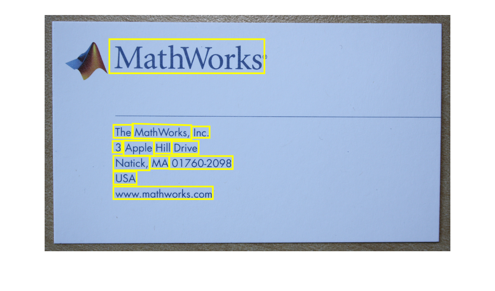
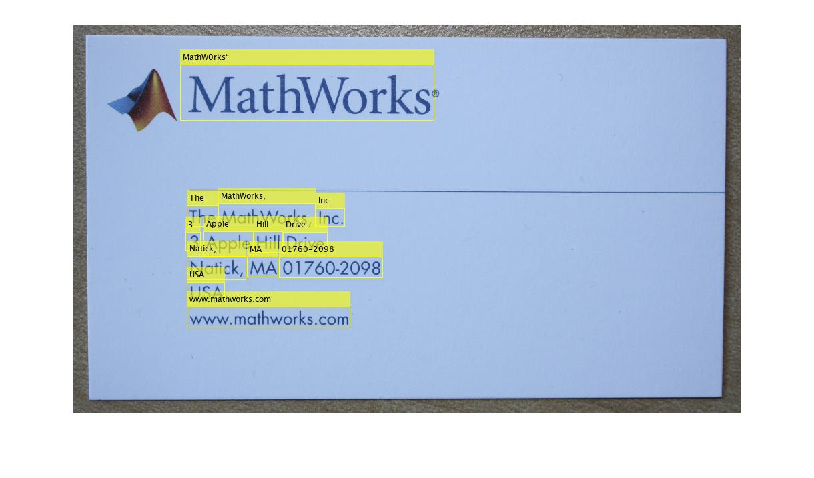

# Text Detection using Deep Learning

This repository implements a pretrained Character Region Awareness For Text detection (CRAFT) [1] model in MATLAB&reg;.

[](https://matlab.mathworks.com/open/github/v1?repo=matlab-deep-learning/Text-Detection-using-Deep-Learning)

**Creator**: MathWorks Development

Requirements
------------  

- MATLAB R2022a or later
- Deep Learning Toolbox&trade;
- Computer Vision Toolbox&trade;
- Computer Vision Toolbox&trade; Model for Text Detection
  
Note: Previous MATLAB release users can use this branch to download the pretrained models.

Overview
--------

This repository implements text detection in images using CRAFT deep learning model with VGG-16 as backbone. The network is trained on various scene text detection datasets with text in English, Korean, Italian, French, Arabic, German and Bangla (Indian). 

CRAFT uses a convolutional neural network to produce two outputs, region score, and affinity score. The region score localizes individual characters in the image, and the affinity score groups each character into a single instance. The character-level region awareness mechanism helps in detecting texts of various shapes such as long, curved, and arbitrarily shaped texts.

Getting Started
---------------
[detectTextCRAFT](https://in.mathworks.com/help/vision/ref/detecttextcraft.html) - Detect texts in images by using CRAFT deep learning model

Detect Text Using Pretrained CRAFT
---------------------------------------
Note: This functionality requires Deep Learning Toolbox&trade; and the Computer Vision Toolbox&trade; Model for Text Detection. You can install the Computer Vision Toolbox Model for Text Detection from Add-On Explorer. For more information about installing add-ons, see [Get and Manage Add-Ons](https://in.mathworks.com/help/matlab/matlab_env/get-add-ons.html).
```
% Read test image.
  orgImg = imread('businessCard.png');

% Perform text detection
  bboxes = detectTextCRAFT(orgImg);
    
% Visualize results
  outImg = insertShape(orgImg,"rectangle",bboxes,LineWidth=3);
  figure; imshow(outImg);
```



Text Recognition using OCR + CRAFT
----------------------------------

Output of `detectTextCRAFT` return the bounding boxes that can be passed to `ocr` function as region of interest (roi) for text recognition applications.

```
% Binarizing the image before using OCR for better results.
  I = rgb2gray(orgImg);
  BW = imbinarize(I, 'adaptive','ForegroundPolarity','dark','Sensitivity',0.5);
  figure; imshow(BW);

% OCR this image using region-of-interest for OCR to avoid processing non-text background.
  txt = ocr(BW,bboxes,'LayoutAnalysis','word');

% Display the recognized words.
  recognizedWords = cat(1,txt(:).Words);
  Iocr = insertObjectAnnotation(orgImg, 'rectangle',bboxes,recognizedWords);
  figure; imshow(Iocr);
```



Accuracy
---------

| Dataset | Recall | Precision  | Hmean |
| ------ | ------ | ------ | ------ |
| ICDAR2013[2] | 92.60 | 91.84 | 91.81 |
| ICDAR2017[3] | 62.29 | 78.68 | 69.53 |

CRAFT Network Architecture
--------------------------


The architecture of CRAFT is composed of VGG-16 as backbone and skip connections in the decoding part, similar to U-net to aggregate low-level features. The UpConv blocks are made of convolutional and batch normalization layers. These blocks are used to perform upsampling.

The pretrained CRAFT network takes the image as input and generates the output feature map with two channels that correspond to region score and affinity score. The region score represents the probability that the given pixel is the center of the character, and the affinity score represents the center probability of the space between adjacent characters. 


Publication
-----------

[1] Baek, Y., Lee, B., Han, D., Yun, S. and Lee, H., 2019. Character region awareness for text detection. In Proceedings of the IEEE/CVF Conference on Computer Vision and Pattern Recognition (pp. 9365-9374).

[2] https://rrc.cvc.uab.es/?ch=2&com=downloads

[3] https://rrc.cvc.uab.es/?ch=8&com=downloads

Copyright 2021 The MathWorks, Inc.
